# 语脉 VerbaPath 新手使用手册

本手册面向第一次使用语脉的用户。截图来自当前软件真实界面，主要帮助你快速理解每个模块的作用，以及第一次应该从哪里开始。

> 建议路线：先完成基础设置，再导入内容，接着用闪卡、阅读、翻译、写作和笔记形成自己的学习闭环。

说明：本版截图以移动端界面为主。电脑端功能入口基本一致，只是左侧菜单会更宽，部分面板会以左右分栏显示。

## 0. 移动端导航：底栏和菜单

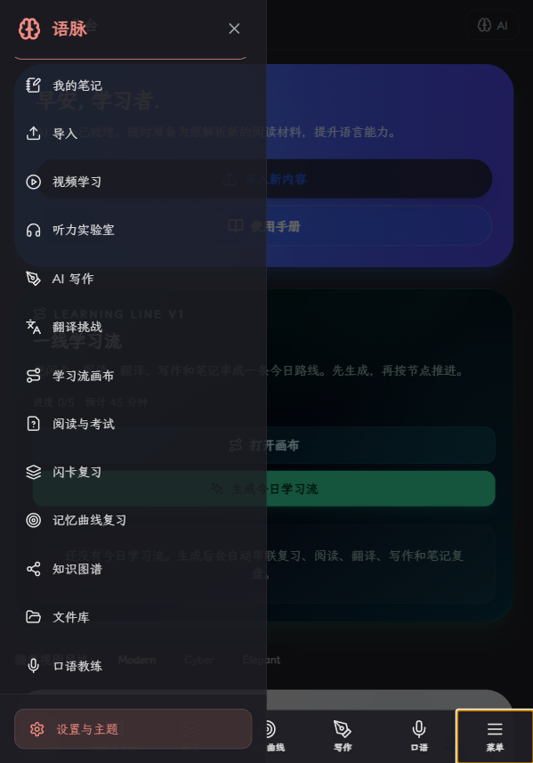

移动端底部会保留最常用入口，例如首页、阅读与考试、复习、记忆曲线、写作、口语和菜单。

如果你找不到某个功能，先点右下角“菜单”。菜单里可以进入我的笔记、导入、视频学习、翻译挑战、学习流画布、知识图谱、文件库和设置。

新手建议：

- 常用训练从底栏进入。
- 偶尔使用的管理功能从菜单进入。
- 如果页面看起来太挤，优先检查是否打开了 AI 侧栏或其他抽屉。

## 1. 工作台：查看今日学习入口

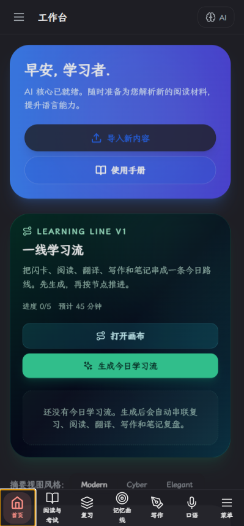

工作台是软件的总入口。你可以在这里看到今日学习概览、快速导入新内容，以及进入“一线学习流”。

新手建议：

1. 第一次打开后，先去“设置与主题”确认 API 和主题。
2. 如果已经有文章、单词或学习资料，可以点击“导入新内容”。
3. 如果想按系统推荐路线学习，可以使用“一线学习流”。

注意：工作台主要是入口页，不建议在这里找所有细节功能，具体训练要进入对应模块。

## 2. 导入：把学习材料放进软件

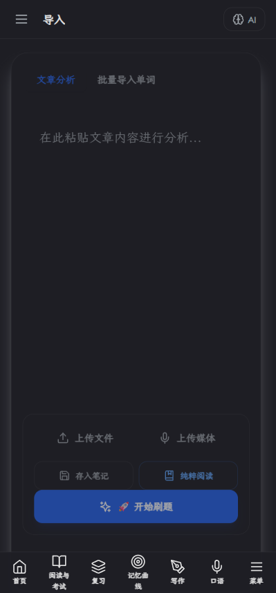

导入页面用于把单词、文章、文本材料加入系统。导入后的内容会进入闪卡、阅读、笔记等模块。

常见用法：

1. 导入单词列表，生成闪卡。
2. 导入文章，用于阅读理解、阅读标记和生词整理。
3. 导入学习材料后，再进入对应模块训练。

新手建议：

- 如果只是想背单词，先导入词表。
- 如果想练阅读，先导入文章，再进入“阅读与考试”。
- 导入后建议检查生成内容是否正确，尤其是释义、音标和分组。

## 3. 闪卡复习：背单词和巩固记忆

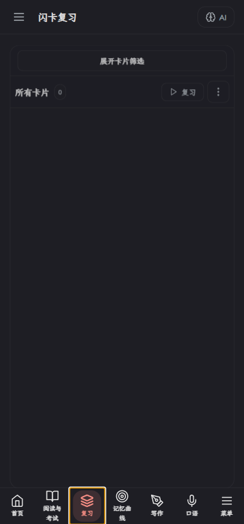

闪卡复习用于管理单词卡片、按文件夹复习、查看今日待复习内容。

核心操作：

1. 在卡片库中选择文件夹或范围。
2. 点击“复习”开始一轮闪卡训练。
3. 学习时先看正面，再翻面查看释义，然后按掌握程度评分。

评分理解：

- 忘记：完全没记住，下次会更快出现。
- 困难：勉强记得，需要较快复习。
- 良好：基本掌握，正常间隔复习。
- 简单：很熟悉，复习间隔会拉长。

新手建议：

- 每次不要贪多，先从 10 到 20 张开始。
- 新导入的词优先过一遍，再进入记忆曲线复习。
- 如果某个词特别重要，可以生成深度笔记。

## 3.1 记忆曲线复习：处理真正该复习的内容

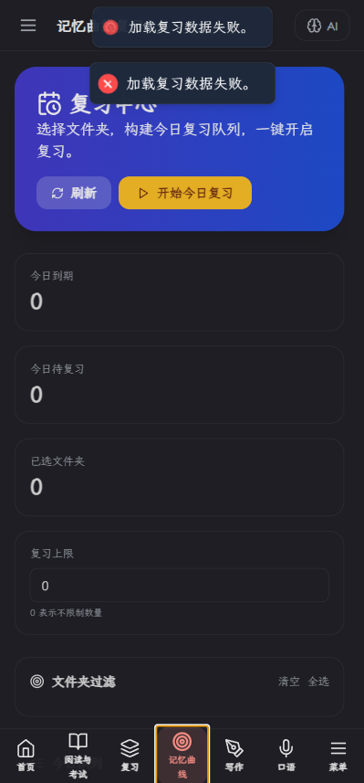

记忆曲线复习更适合长期巩固。它会根据卡片的复习记录、掌握程度和到期状态，把需要复习的内容重新推给你。

适合使用的场景：

- 你已经学过一批词，希望系统帮你安排复习。
- 你不想每次都随机复习全部单词。
- 你想优先处理忘记、困难或到期的卡片。

新手建议：

- 新词第一次学习用“闪卡复习”。
- 已经学过的内容用“记忆曲线复习”。
- 如果今天时间很少，优先完成记忆曲线里的到期内容。

## 4. 阅读与考试：做阅读题、找证据、标记生词

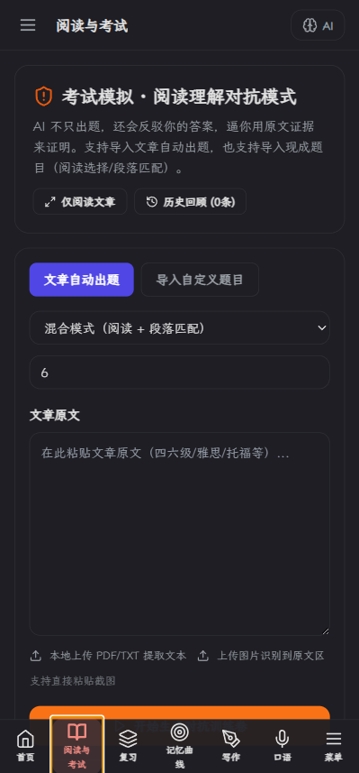

阅读与考试模块用于阅读文章、生成理解题、做段落匹配、查看证据句和进行 AI 反驳训练。

核心流程：

1. 导入或粘贴文章。
2. 选择题型或训练模式。
3. 开始做题。
4. 提交评分后查看正确答案、证据句和错因。
5. 对不理解的题目进入证据反驳，训练“为什么这个答案对”。

阅读标记：

- 生词标记：适合之后加入闪卡。
- 疑难句标记：适合让 AI 分析句法和逻辑。

新手建议：

- 不要只看答案，要重点看证据句。
- 做阅读题时，如果选项不确定，先回原文找依据。
- 生词不要全部加入闪卡，只加入影响理解的关键词。

## 5. 翻译挑战：两轮修订式翻译训练

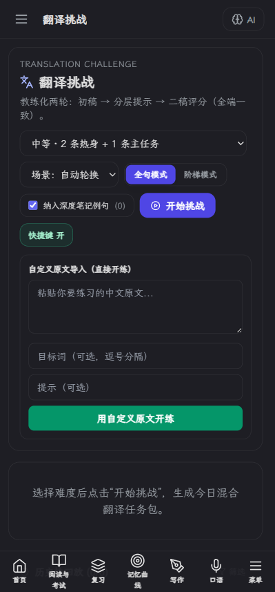

翻译挑战是独立训练模块，用于练习中文到英文的表达能力。它不是简单判对错，而是偏向写作教练：先写初稿，再看提示，最后提交二稿评分。

核心流程：

1. 选择难度和场景。
2. 开始挑战。
3. 写第一版翻译。
4. 查看分层提示，自己修改。
5. 写第二版并评分。
6. 查看五维评分、问题和改写参考。

五维评分包括：

- 忠实度：意思有没有准确传达。
- 自然度：是否像真实英语表达。
- 语法准确度：语法和结构是否稳定。
- 目标词运用：有没有自然使用目标词。
- 语气得体度：是否符合场景。

新手建议：

- 不要第一版就追求完美，重点是“改得更好”。
- 先自己改，再看 AI 改写，这样提升更明显。
- 如果开启深度笔记例句，可以把积累过的例句用于训练。

## 6. AI 写作：从审题到诊断的写作工作台

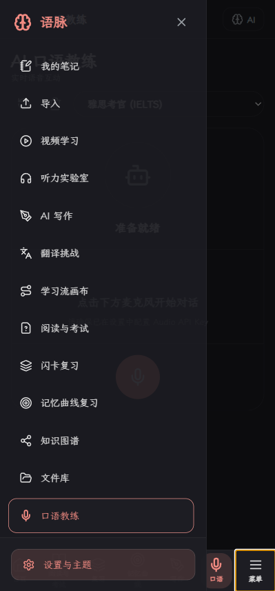

AI 写作用于考试作文、段落写作、素材积累和诊断改进。它不是单纯让 AI 代写，而是帮助你完成“审题、提纲、写作、诊断”的闭环。

推荐流程：

1. 审题：输入题目、考试类型、目标分。
2. 提纲：生成或手写文章结构。
3. 写作：根据提纲自己写正文。
4. 素材包：插入开头、论证句型、连接词或词汇替换。
5. 诊断：查看分项评分和改进建议。

素材包说明：

- 开头立场：适合快速搭建引入句。
- 论证句型：适合扩展主体段。
- 连接与转折：适合增强逻辑。
- 词汇替换：适合把普通表达升级为更地道表达。
- 深度笔记来源：来自你整理过的笔记内容。

新手建议：

- 不要一开始就让 AI 写完整作文，先让它帮你搭提纲。
- 写作区里尽量保留自己的表达，再用诊断修正。
- 素材包是辅助，不是替代你的思考。

## 7. 我的笔记：沉淀知识和建立内链

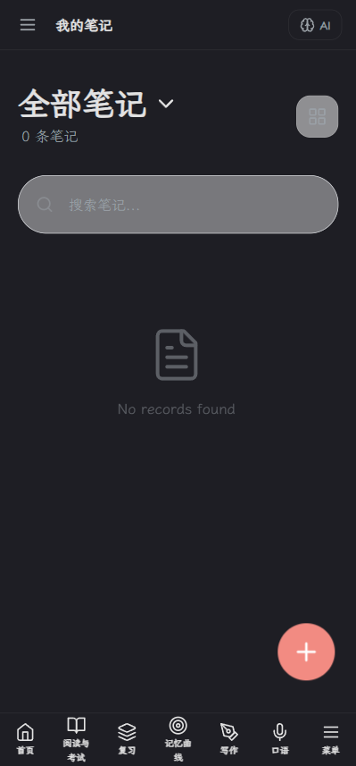

笔记模块用于保存深度笔记、阅读总结、错题整理和学习复盘。它也支持内链，把不同笔记连接起来。

常见用途：

1. 保存某个单词的深度笔记。
2. 整理阅读文章中的关键句和生词。
3. 保存写作诊断结果。
4. 用内链连接相关知识，例如 `[[academic writing]]`。

内链说明：

- 输入 `[[笔记标题]]` 可以链接到其他笔记。
- 如果目标笔记存在，点击后会打开目标笔记。
- 如果目标不存在，可以创建新笔记。
- 反向链接可以帮助你看到“哪些笔记提到了当前笔记”。

新手建议：

- 每天只整理少量真正重要的内容。
- 深度笔记适合做“长期知识库”，不是临时草稿。
- 以后写作、翻译、闪卡都可以从笔记中提取材料。

## 8. 学习流画布：像工作流一样安排学习路线

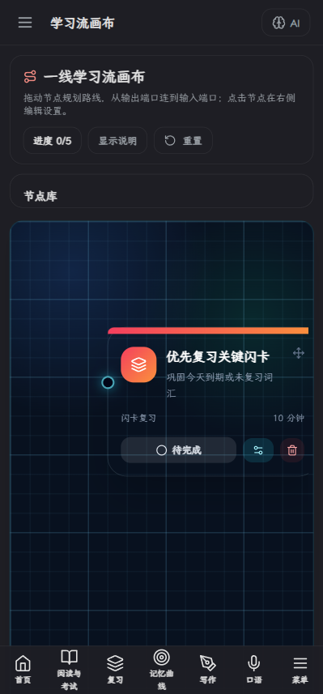

学习流画布用于把不同学习模块串成一条路线，类似把“闪卡、阅读、翻译、写作、笔记”连接成一个可执行流程。

核心概念：

- 节点：一个学习任务，例如闪卡复习、阅读训练、翻译挑战。
- 连线：表示学习顺序或数据流向。
- AI 大脑：分析上游节点结果，给出下一步建议。

新手玩法：

1. 从默认学习流开始，不必一开始自己设计复杂路线。
2. 完成一个节点后，再进入下一个节点。
3. 如果加入 AI 大脑节点，可以让它根据前面的学习结果给建议。

新手建议：

- 初期用默认流程即可。
- 后期可以为考试、词汇、写作分别设计不同学习流。
- 学习流更适合“每天固定训练”，不是一次性临时操作。

## 9. 设置与主题：配置 API、主题和图片总结

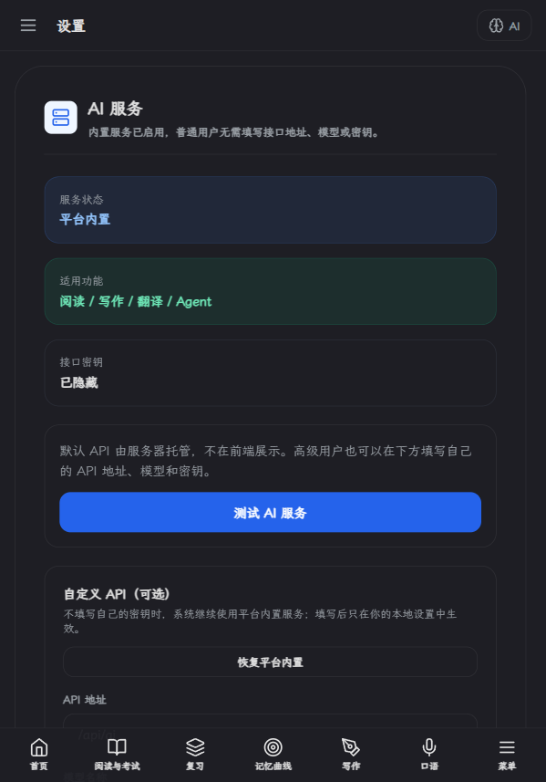

设置页面用于管理主题、AI 接口、模型、图片生成接口和一些个性化选项。

新手必须检查：

1. AI API 地址是否可用。
2. API Key 是否已配置。
3. 模型名称是否正确。
4. 主题是否适合当前设备。

注意：

- 如果 AI 功能无响应，优先检查 API 配置。
- 如果部署到网页端，不建议把真实 API Key 直接暴露给用户浏览器。
- 如果要保护默认 API，后续需要后端代理。

## 10. AI Agent：让 AI 帮你操作软件

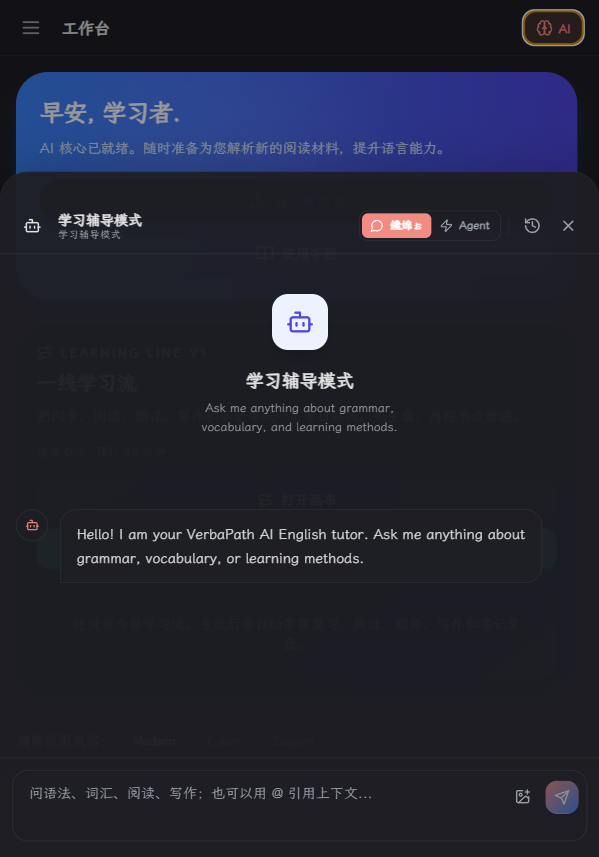

AI Agent 是软件里的操作助手。它不仅能聊天，还能读取学习数据、生成计划、创建笔记、整理内容、操作部分学习模块。

适合让 Agent 做的事：

- 总结今天学习了什么。
- 根据最近学习记录生成复习计划。
- 把一组闪卡整理成笔记。
- 生成深度笔记。
- 帮你规划下一步训练。

使用建议：

1. 指令要尽量具体，比如“把 2026/3/25 文件夹里的闪卡整理成一篇笔记”。
2. 涉及删除、批量修改时，先让它列计划和影响范围。
3. 执行后检查结果，不要完全盲信。

重要提醒：

- Agent 是助手，不是数据库管理员。
- 对删除、批量移动、批量修改这类操作要谨慎。
- 如果结果不符合预期，及时撤销或停止继续操作。

## 推荐的新手学习路径

如果你第一次使用语脉，可以按这个顺序：

1. 设置 API 和主题。
2. 导入一组单词或一篇文章。
3. 用闪卡复习 10 到 20 个词。
4. 用阅读与考试做一篇文章。
5. 把生词和疑难句整理到笔记。
6. 用翻译挑战练 1 组表达。
7. 用 AI 写作写一小段作文。
8. 最后让 Agent 生成今日学习总结。

## 常见问题

### AI 没反应怎么办？

先检查设置页里的 API URL、API Key 和模型名称。如果你使用网页部署版，还要确认是否配置了后端代理。

### 为什么导入后没有马上看到内容？

导入内容通常会进入对应模块，例如单词进入闪卡，文章进入阅读或文件库。导入后建议去对应模块检查。

### 闪卡复习为什么会重复出现？

如果是记忆曲线复习，系统会根据掌握程度、到期时间和复习记录安排出现频率。忘记或困难的卡会更快回来。

### 写作素材包是不是让 AI 替我写？

不是。素材包更像表达工具箱，用来帮助你升级句子、连接逻辑和积累表达。核心作文仍然建议自己写。

### 深度笔记有什么用？

深度笔记是长期知识库。它可以沉淀单词、例句、写作素材和翻译难点，后续还能被写作、翻译和学习流调用。

## 最后建议

语脉的核心不是“打开一个功能用一次”，而是把学习资料变成可复习、可回顾、可再利用的知识系统。

最有效的使用方式是：

- 导入资料
- 训练
- 标记问题
- 整理笔记
- 再用 AI 和学习流复盘

这样你不是在重复刷题，而是在逐步建立自己的英语学习操作系统。
